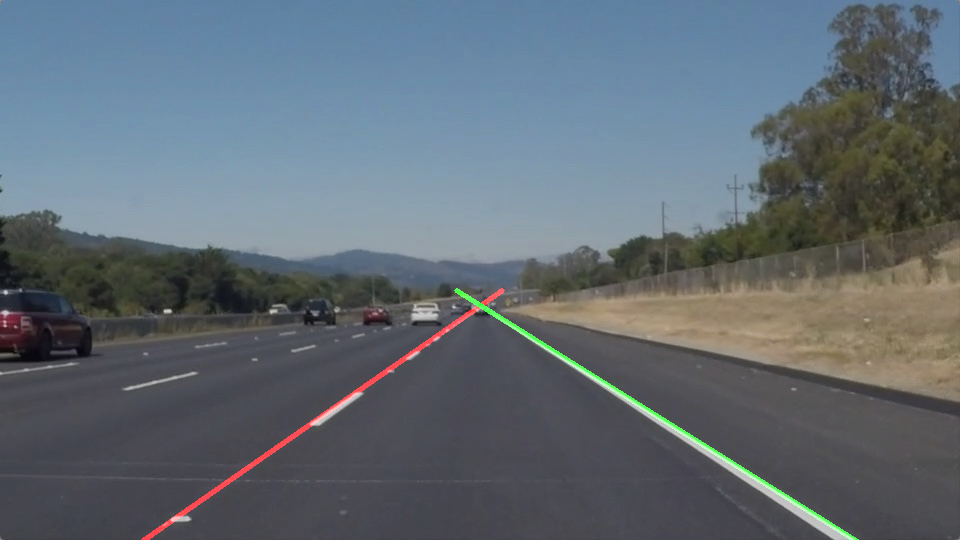

# **Finding Lane Lines on the Road** 

## Writeup Template

### Mostly got the first project working. Had trouble with the challenge though.

---

**Finding Lane Lines on the Road**

The goals / steps of this project are the following:
* Make a pipeline that finds lane lines on the road
* Reflect on your work in a written report

---

### Reflection

### 1. Describe your pipeline. As part of the description, explain how you modified the draw_lines() function.

My pipeline consisted of 5 steps. First, I converted the images to grayscale, then I blurred the image with a guassian
kernel of size 3x3. Then I masked the image to only look at
the area of interest. Then I ran the canny edge detection algorithm. This resulted in many edges. 

In order to draw a single line on the left and right lanes, I modified the draw_lines() function by grouping the edges into 
2 groups based on whether they have positive or negative slope. I tried 4 different approaches to  draw a single line in place of each of the
group of edges. 
a. extend the longest detected line
b. create a line with the parameters obtained by weighted average of the hough-transformed parameters weighted by the length of the line
c. create a line with the median of the parameters of hough-transformed lines
d. sort all the points in each of the group based on increasing x-coordinate and join them.

Among the 4 approaches, the one where I extended the longest line seemed to work the best. I have left the other pieces of trial code in the 
submission.

### 2. Identify potential shortcomings with your current pipeline

One potential shortcoming would be what would happen when ... 

Another shortcoming could be ...

### 3. Suggest possible improvements to your pipeline

A possible improvement would be to ...

Another potential improvement could be to ...
